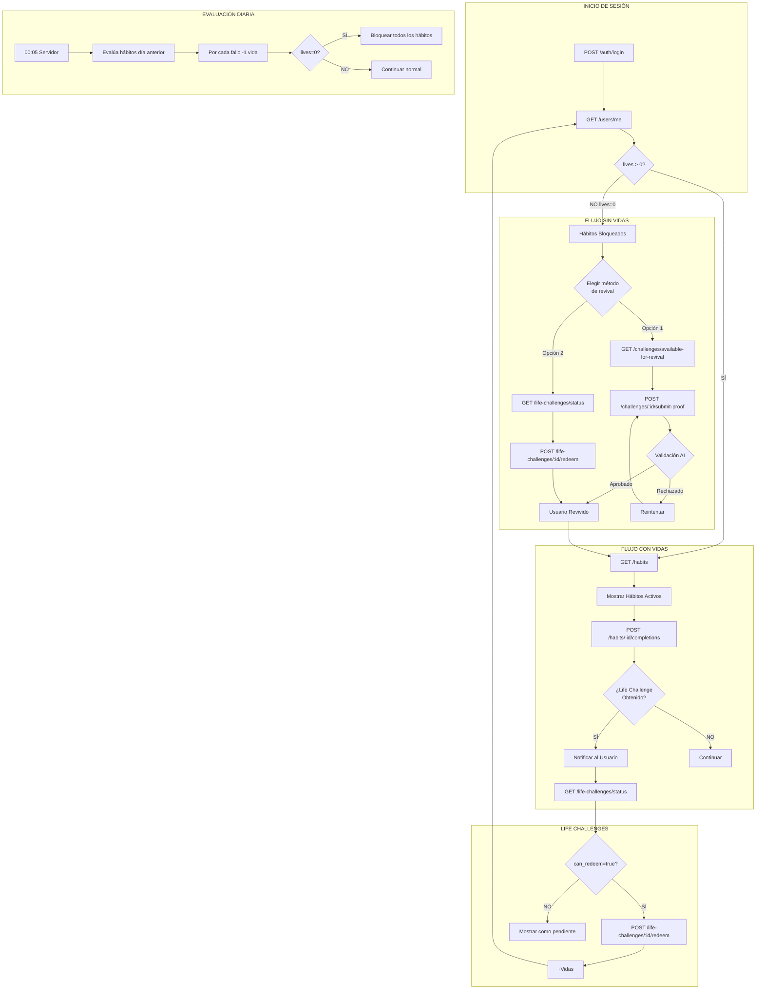

# 🔗 RELACIÓN ENTRE APIs - DIAGRAMA DE FLUJOS

## 📊 MAPA DE RELACIONES ENTRE ENDPOINTS



## 🎯 CUÁNDO USAR CADA API

### 1. APIs DE ESTADO INICIAL
```
GET /users/me
  ↓
GET /habits
  ↓
GET /life-challenges/status
```
**Usar al**: Iniciar app, después de login, al volver del background

---

### 2. APIs DE OPERACIÓN DIARIA
```
POST /habits/:id/completions
  ↓ (si hay Life Challenge nuevo)
GET /life-challenges/status
  ↓ (si can_redeem=true)
POST /life-challenges/:id/redeem
```
**Usar cuando**: Usuario marca hábitos como completados

---

### 3. APIs DE RESURRECCIÓN (lives=0)

#### Ruta A: Challenge con Pruebas
```
GET /challenges/available-for-revival
  ↓
POST /challenges/:id/submit-proof
  ↓ (opcional)
GET /challenges/:id/proof-status
```

#### Ruta B: Life Challenge
```
GET /life-challenges/status
  ↓ (si alguno tiene can_redeem=true)
POST /life-challenges/:id/redeem
```
**Usar cuando**: Usuario no tiene vidas y necesita revivir

---

## 🔄 SINCRONIZACIÓN DE ESTADOS

### Estados que Cambian y APIs Relacionadas

| Estado Cambia | Trigger | APIs a Llamar | UI Update |
|--------------|---------|---------------|-----------|
| **Vidas bajan** | 00:05 diario | `GET /users/me` | Actualizar contador |
| **Lives = 0** | Evaluación diaria | `GET /habits` | Bloquear UI hábitos |
| **Hábito completado** | Usuario marca | `POST /completions` | Check verde |
| **Life Challenge obtenido** | Al completar hábito | Incluido en response | Mostrar notificación |
| **Challenge validado** | Envío de pruebas | `POST /submit-proof` | Revival screen |
| **Usuario revive** | Challenge aprobado | `GET /users/me` + `GET /habits` | Desbloquear todo |
| **Life Challenge redimido** | Click redimir | `POST /redeem` | +Vidas, actualizar lista |

---

## 🌊 FLUJO DE DATOS ENTRE COMPONENTES

```javascript
// 1. COMPONENTE PRINCIPAL
function App() {
  // Estado global
  const [user, setUser] = useState(null);
  const [habits, setHabits] = useState([]);
  const [lifeChallenges, setLifeChallenges] = useState([]);

  // Carga inicial - TODAS las APIs base
  useEffect(() => {
    loadInitialData();
  }, []);

  async function loadInitialData() {
    // ORDEN IMPORTANTE:
    // 1. Usuario primero (para saber vidas)
    const userData = await api.get('/users/me');
    setUser(userData);

    // 2. Hábitos (cambian según vidas)
    const habitsData = await api.get('/habits');
    setHabits(habitsData);

    // 3. Life Challenges (siempre al final)
    const lcData = await api.get('/life-challenges/status');
    setLifeChallenges(lcData);
  }

  // Renderizado condicional según vidas
  if (user?.lives === 0) {
    return <NoLivesFlow onRevive={loadInitialData} />;
  }

  return <NormalFlow />;
}

// 2. FLUJO SIN VIDAS - Maneja ambos tipos de revival
function NoLivesFlow({ onRevive }) {
  const [revivalMethod, setRevivalMethod] = useState(null);

  if (revivalMethod === 'challenge') {
    return (
      <ChallengeRevival
        onSuccess={onRevive}  // Recargar todo tras revival
      />
    );
  }

  if (revivalMethod === 'life-challenge') {
    return (
      <LifeChallengeRevival
        onSuccess={onRevive}  // Recargar todo tras revival
      />
    );
  }

  // Menú de opciones
  return (
    <RevivalOptions
      onSelectChallenge={() => setRevivalMethod('challenge')}
      onSelectLifeChallenge={() => setRevivalMethod('life-challenge')}
    />
  );
}

// 3. REVIVAL CON CHALLENGE - Flujo completo
function ChallengeRevival({ onSuccess }) {
  const [challenges, setChallenges] = useState([]);
  const [selected, setSelected] = useState(null);
  const [step, setStep] = useState('list'); // list -> proof -> validating

  // Cargar challenges disponibles
  useEffect(() => {
    api.get('/challenges/available-for-revival')
      .then(res => setChallenges(res.challenges));
  }, []);

  async function submitProof(text, imageUrl) {
    setStep('validating');

    const result = await api.post(
      `/challenges/${selected.user_challenge_id}/submit-proof`,
      { proofText: text, proofImageUrl: imageUrl }
    );

    if (result.success) {
      onSuccess(); // Trigger recarga completa
    } else {
      setStep('proof'); // Volver a intentar
      alert('Pruebas insuficientes');
    }
  }

  // UI según paso
  switch(step) {
    case 'list':
      return <ChallengeList {...} />;
    case 'proof':
      return <ProofForm {...} />;
    case 'validating':
      return <LoadingScreen />;
  }
}

// 4. COMPLETAR HÁBITO - Maneja Life Challenges automáticos
async function completeHabit(habitId, date) {
  const response = await api.post(`/habits/${habitId}/completions`, {
    date,
    completed: 1,
    progress_type: 'yes_no'
  });

  // IMPORTANTE: La respuesta puede incluir Life Challenges
  if (response.new_life_challenges_obtained?.length > 0) {
    // Actualizar estado global
    setLifeChallenges(prev => [
      ...prev,
      ...response.new_life_challenges_obtained
    ]);

    // Notificar al usuario
    showNotification({
      title: '🎉 Life Challenge Obtenido',
      body: response.new_life_challenges_obtained[0].title,
      action: () => navigateTo('/life-challenges')
    });
  }

  // Actualizar UI del hábito
  markHabitAsComplete(habitId);
}
```

---

## 🔀 DEPENDENCIAS ENTRE ENDPOINTS

### Endpoints Independientes (pueden llamarse en paralelo)
```javascript
// ✅ CORRECTO - Paralelo
const [user, habits, challenges] = await Promise.all([
  api.get('/users/me'),
  api.get('/habits'),
  api.get('/life-challenges/status')
]);
```

### Endpoints Dependientes (deben ser secuenciales)
```javascript
// ✅ CORRECTO - Secuencial
// 1. Primero verificar vidas
const user = await api.get('/users/me');

// 2. Solo si no tiene vidas
if (user.lives === 0) {
  const challenges = await api.get('/challenges/available-for-revival');
}

// 3. Después de seleccionar uno
const proof = await api.post('/challenges/:id/submit-proof', data);

// 4. Si fue exitoso, recargar usuario
if (proof.success) {
  const updatedUser = await api.get('/users/me');
}
```

### Endpoints que Modifican Estado Global
```javascript
// Estos endpoints cambian el estado y requieren refrescar:

// 1. POST /habits/:id/completions
//    → Puede obtener Life Challenges
//    → No requiere refresh si incluye data en response

// 2. POST /challenges/:id/submit-proof (exitoso)
//    → Usuario revive
//    → REQUIERE: GET /users/me + GET /habits

// 3. POST /life-challenges/:id/redeem
//    → Cambia vidas
//    → REQUIERE: GET /users/me

// 4. POST /habits/:id/deactivate
//    → Borra progreso
//    → REQUIERE: GET /habits
```

---

## 🚨 CASOS ESPECIALES Y EDGE CASES

### 1. Usuario Completa Hábito y Obtiene Life Challenge
```
POST /habits/:id/completions
  ↓
Response incluye: new_life_challenges_obtained
  ↓
NO llamar GET /life-challenges/status (ya tienes la info)
  ↓
Actualizar estado local directamente
```

### 2. Usuario Sin Challenges Asignados
```
GET /challenges/available-for-revival
  ↓
Response: challenges = []
  ↓
Mostrar: "Primero asigna challenges a tus hábitos"
  ↓
Redirigir a: GET /challenges (lista general)
  ↓
POST /challenges/:id/assign
```

### 3. Usuario Intenta Redimir con Vidas Máximas
```
GET /users/me → lives: 2, max_lives: 2
  ↓
POST /life-challenges/:id/redeem
  ↓
Error 400: "Cannot gain more lives"
  ↓
UI: Deshabilitar botones de redimir
```

### 4. Evaluación Diaria Mientras App Abierta
```
Usuario usando app a las 00:05
  ↓
Servidor evalúa y resta vidas
  ↓
Frontend no se entera automáticamente
  ↓
SOLUCIÓN: Polling cada minuto o WebSocket
  ↓
if (hora === '00:06') { refetchUser() }
```

---

## 📱 IMPLEMENTACIÓN MÓVIL (React Native)

### Background Fetch para Sincronización
```javascript
// Registrar tarea en background
BackgroundFetch.configure({
  minimumFetchInterval: 15, // minutos

  async task(taskId) {
    // Sincronizar con backend
    const user = await api.get('/users/me');

    // Si perdió vidas, notificar
    if (user.lives < lastKnownLives) {
      PushNotification.localNotification({
        title: '⚠️ Perdiste vidas',
        message: `Te quedan ${user.lives} vidas`
      });
    }

    BackgroundFetch.finish(taskId);
  }
});
```

### Notificaciones Locales Programadas
```javascript
// Programar evaluación diaria
PushNotification.localNotificationSchedule({
  title: '🌙 Evaluación de hábitos',
  message: 'Revisando tus hábitos del día...',
  date: new Date(Date.now() + getMsUntil0005()),
  repeatType: 'day'
});
```

---

## 🎮 GAMIFICACIÓN Y FEEDBACK

### Momentos Clave para Feedback Visual
```javascript
// 1. PÉRDIDA DE VIDA
onLiveLost() {
  vibrate();
  showHeartBreaking();
  playSound('life_lost.mp3');
}

// 2. QUEDARSE SIN VIDAS
onGameOver() {
  showSkullAnimation();
  fadeToGrayscale();
  disableInteractions();
}

// 3. RESURRECCIÓN
onRevival() {
  showPhoenixAnimation();
  fadeToColor();
  enableInteractions();
  confetti();
}

// 4. LIFE CHALLENGE OBTENIDO
onLifeChallengeUnlocked() {
  showStarBurst();
  playSound('achievement.mp3');
  pulseButton('Redeem');
}
```

---

## 🔐 SEGURIDAD Y VALIDACIÓN

### Validaciones Frontend Antes de Llamar APIs
```javascript
// Antes de completar hábito
function canCompleteHabit(habit, user) {
  if (user.lives === 0) return false;
  if (!habit.is_active) return false;
  if (habit.disabled_reason) return false;
  if (alreadyCompletedToday(habit)) return false;
  return true;
}

// Antes de redimir Life Challenge
function canRedeemLifeChallenge(challenge, user) {
  if (!challenge.can_redeem) return false;
  if (challenge.status !== 'obtained') return false;
  if (user.lives >= user.max_lives && challenge.reward > 0) return false;
  return true;
}

// Antes de enviar pruebas
function validateProof(text, image) {
  if (!text && !image) return 'Debes enviar al menos una prueba';
  if (text && text.length < 20) return 'Descripción muy corta';
  if (image && image.size > 5000000) return 'Imagen muy pesada (max 5MB)';
  return null;
}
```

---

## 📈 MÉTRICAS Y ANALYTICS

### Eventos a Trackear
```javascript
analytics.track('habit_completed', {
  habitId,
  date,
  currentLives: user.lives,
  streak: habit.current_streak
});

analytics.track('lives_lost', {
  count: livesLost,
  reason: 'habit_missed',
  habitsFaild: missedHabits.length
});

analytics.track('revival_attempted', {
  method: 'challenge_proof' | 'life_challenge',
  currentLives: 0
});

analytics.track('revival_successful', {
  method,
  livesGained,
  timeWithoutLives: Date.now() - diedAt
});

analytics.track('life_challenge_obtained', {
  challengeId,
  title,
  trigger: 'habit_completion'
});
```

---

**Este documento te muestra exactamente cómo se relacionan todas las APIs y cuándo usar cada una. Síguelo como una guía paso a paso para implementar el frontend correctamente.**